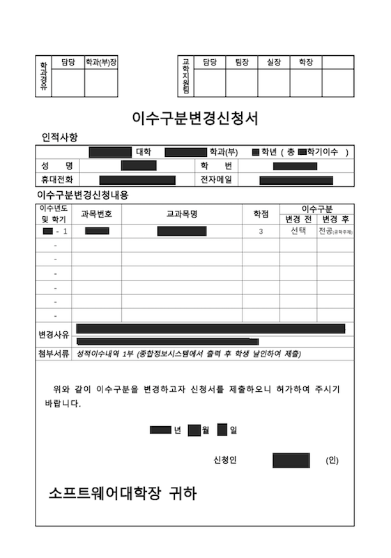
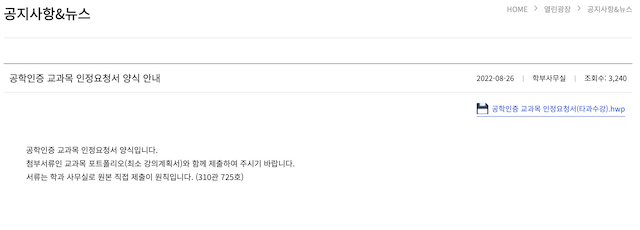
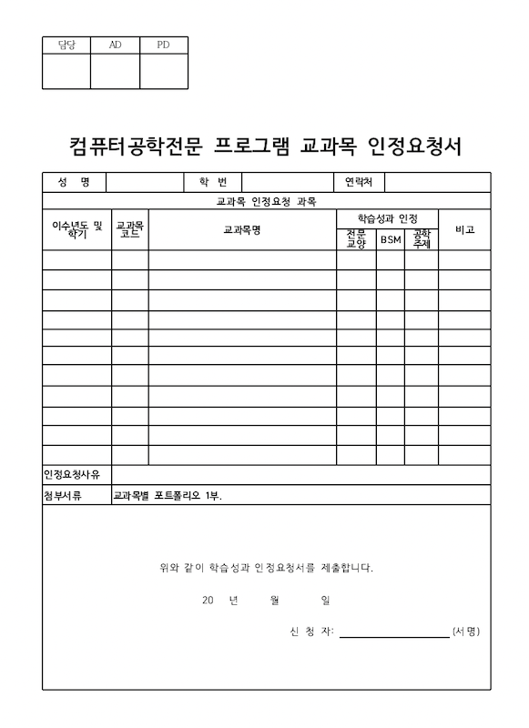
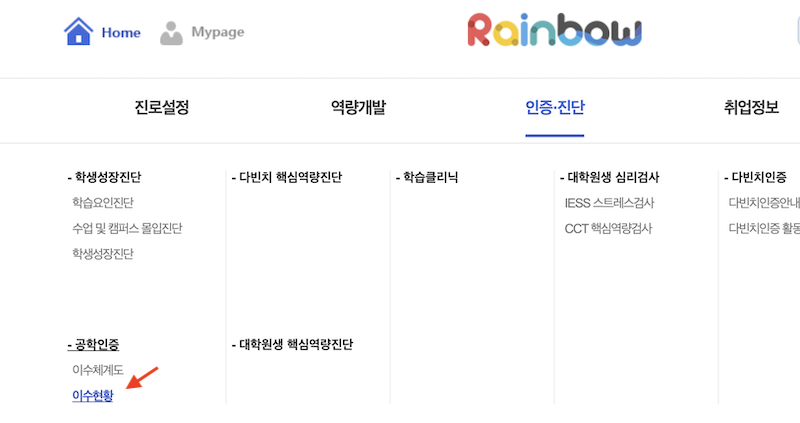
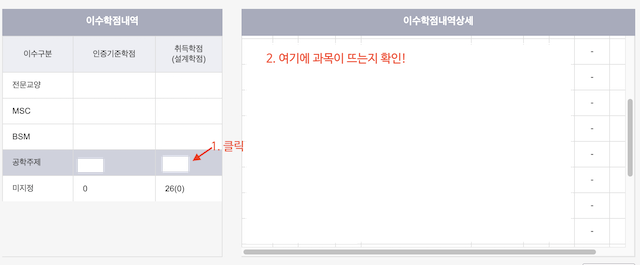

# 공학인증 관련 Tip

현재 공학인증이 필수이기 때문에 특이하게 수업(ex. 코드쉐어 과목 수강)을 수강할 경우 따로 인정을 받아야 합니다.

이러한 것에 관해서 적어두는 문서입니다.

---

## 타과 과목을 수강했는 경우(코드쉐어)

만약 코드쉐어로 타과의 수업을 듣는 경우 자유선택으로 분류됩니다.

이런 경우 전공 과목으로 인정받기 위해 "[이수 구분 변경 신청서](/docs/abeek#이수-구분-변경-신청서)"를 제출해야 합니다.

⚠️ 하지만! 우리는 `공학인증`이 필수입니다. 그렇기 때문에 공학인증 과목으로 인증받기 위해 또 다른 서류인 "[교과목 인정 요청서](/docs/abeek#교과목-인정-요청서)"를 제출해야 할 수도 있습니다.

공학주제인지 아닌지 판단하는 법 예시

- 만약 전전의 "운영체제" 과목처럼 같은 `공학인증 프로그램 학과`이며 `공학주제 과목`이면 상관 없습니다. [이수 구분 변경 신청서](/docs/abeek#이수-구분-변경-신청서)만 제출하셔도 됩니다.
- 하지만 전전의 "객체지향프로그래밍" 과목처럼 공학주제가 아닌 `MSC` 과목이거나 `공학인증이 없는 학과의 코드쉐어 과목`을 수강한 경우 [교과목 인정 요청서](/docs/abeek#교과목-인정-요청서)를 제출해야 합니다.

---

## 각종 요청서

### 이수 구분 변경 신청서

타과의 수업을 듣은 경우 자유선택에서 전공 과목으로 이수구분을 변경하기 위해 제출하는 이수 구분 변경 신청서.

이수구분을 변경합니다.

링크: 삭제된 것 같습니다..? 공지사항에 없다면 학과 방문하거나에 연락하면 받을 수 있을 겁니다.

#### 이수 구분 변경 신청서 첨부파일

성적이수내역을 첨부서류로 요구하는데 "포탈 > 강의마당 > 보관성적조회"에 가면 출력 버튼이 있을 겁니다. 여기서 받은 성적 내역을 출력하고 서명해서 제출했습니다.

작성한 이수 구분 변경 신청서랑 첨부서류를 출력해서 학부에 제출하면 처리해줍니다.

#### 이수 구분 변경 결과 확인법

나중에 보관성적조회 페이지에서 신청한 과목의 이수구분이 "전공"으로 표기되는지 확인하세요!

---

### 교과목 인정 요청서

공학인증 과목으로 인정받기 위해 제출하는 `컴퓨터공학 전문 프로그램 교과목` 인정 요청서.

링크: [https://cse.cau.ac.kr/sub05/sub0501.php?nmode=view&code=oktomato_bbs05&uid=2493&search=title&keyword=%EC%96%91%EC%8B%9D&temp1=&offset=1](https://cse.cau.ac.kr/sub05/sub0501.php?nmode=view&code=oktomato_bbs05&uid=2493&search=title&keyword=%EC%96%91%EC%8B%9D&temp1=&offset=1)

#### 교과목 인정 요청서 첨부파일

교과목 포트폴리오를 첨부서류로 요구합니다.
저는 당시 과목의 강의계획서와 제출했던 과제와 공부 내용을 정리해서 제출했습니다.

#### 교과목 인정 결과 확인법

공학주제로 분류되었는지 확인하면 됩니다.

`레인보우시스템`에 접속하고 상단 메뉴에서 "인증진단 > 공학인증 > 이수현황"을 클릭합니다.

좌측의 `이수학점내역` 테이블의 공학주제를 클릭한 후 우측의 `이수학점내역상세` 테이블에 신청한 과목이 뜨는지 확인해보세요.

만약에 `미지정`으로 분류되어있다면 처리되지 않은 겁니다.

레인보우시스템은 가끔 이상하게 동작합니다. 확실한 것은 과사에 문의해보셔야 합니다!
