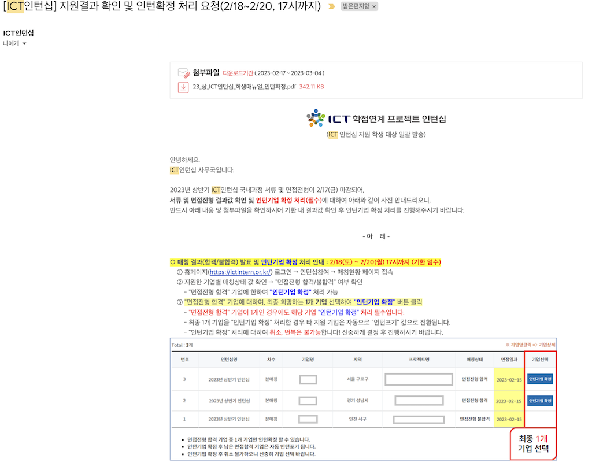
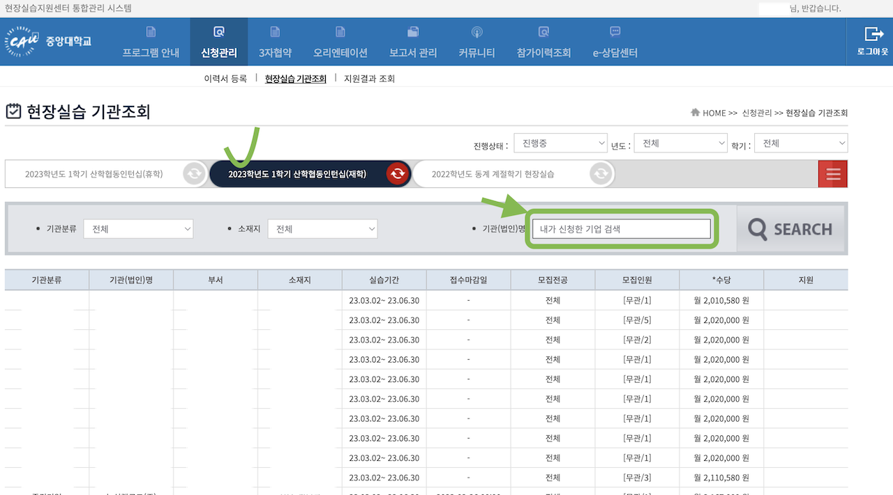
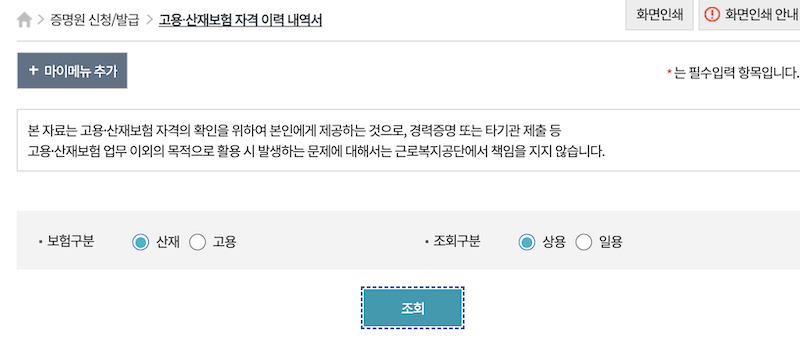
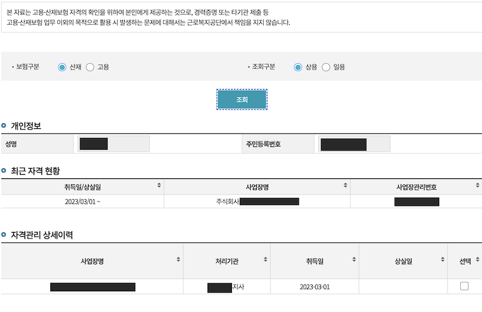
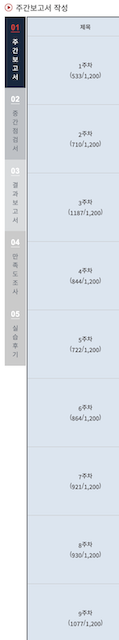

# ICT인턴십 후기

저는 이번 학기에 `2023년 상반기 ICT학점연계프로젝트인턴십(국내과정)`을 하게 되었습니다.

아무래도 문서화된 상세한 정보가 없어서 이것저것 궁금한 것을 친구들에게 물어보고는 했습니다.
제가 ICT인텁십 지원부터 보고서 작성, 학점 인정까지 모든 과정을 공유하면 도움이 되지 않을까해서 적어봅니닷..

❗️ 기업명, 업무 내용, 제 개인정보, 등의 정보는 모두 가리고 올립니다.

:::danger 주의 - 참고용으로만!
제가 경험한 내용을 적습니다.

이 모든 내용은 개인적으로 알아보거나 겪은 내용이기 때문에 정확한 정보가 아닐 수 있습니다.
관련 내용은 참고용으로만 쓰시고 꼭 한번 관련 기관에 문의해보시길 바랍니다.
:::

## ICT학점연계프로젝트인턴십 기간

`23년 상반기 4개월 (3월 2일 ~ 6월 30일)

- 일 8시간
- 주 5회

## 지원

학교에서 올려준 공지글을 보고 ICT학점연계프로젝트인턴십(줄여서, ICT인턴십)에 대해서 알게되었습니다.

> 공지글 [(링크)](https://swedu.cau.ac.kr/board/view?menuid=001005005&pagesize=10&boardtypeid=7&boardid=680)

### 지원 자격

- 신청일 기준 교육과정 50% 이상 이수자여야 합니다.
  - 4년제 대학 기준 `4학기 이상 이수자`여야 합니다.
- 승인된 대학 내 참여학과 `전공/복수전공/부전공` 학생이어야 합니다
  - 승인 대학 및 참여학과 여부는 홈페이지 공지사항에 올라옵니다.
- `3월 1일 ~ 6월 30일` 인턴십 전체 기간동안 인턴십을 정상적으로 수행하고 그에 대한 학점 이수가 가능한 **재학생**이어야 합니다.
  - 우리는 등록금을 전부 납부하셔야 합니다.
- 졸업유예자, 초과학기생 등 특수한 상황인 경우 반드시 학교 측에 사전 문의를 통해 참여 가능 여부 확인해야 합니다.
  - 우리 학부는 졸업유예자의 경우 풀-등록금을 납부해야 학점 인정 가능하답니다.

### 지원 과정

1. 서류 접수

- 지원서와 함께 원하는 기업에 신청합니다.

2. (요구 시) 코딩 테스트

- 코딩 테스트를 요구하는 기업에 한해서 코딩 테스트를 봅니다.

3. 면접

- 서류전형을 합격했다면, 면접을 봅니다.

4. 확정

- 합격한 기업 중, 한 곳을 확정지어야 합니다.

5. 학교와 연계 (placement, 3자 협약)

- `1.`~`3.`까지의 지원과정은 ICT인턴 기관을 통해 수행됩니다. 사무국에서 합격자 명단을 학교에 넘겨주면 기업과 우리 학교와 협약을 해야 합니다.
- 이메일을 통해 안내가 계속 오기 때문에 어려운 것은 없었습니다.

---

> 각각의 지원과정에 대해서 상세히 알아봅시다.

#### 1. 서류 지원하는 법

관련해서는 매뉴얼에 잘 안내되어 있습니다.
매뉴얼: [(링크)](https://ictintern.or.kr/jsp/common/login_board_detail.do)

따로 연락주시면 제 이력서, 자소서, 포트폴리오도 공유해드릴 수 있습니다. 여기에 올리기에는 부끄럽네요..

1. 공식 홈페이지(<https://ictintern.or.kr/>) 접속 및 로그인
   - 계정 없으면 회원가입
2. 인턴십참여 탭의 `인턴십신청` 클릭
   
3. 인턴십 지원 희망기업 `지원` 클릭

:::tip 최대 3개
최대 3개 기업에 지원 가능하며 여러 곳을 합격하셨다면 나중에 한 곳만 확정지으시면 됩니다.
신청 기간 동안 지원했던 기업의 지원을 취소하고 다른 곳에 신청할 수도 있습니다.
:::

#### 2. 코딩 테스트

코딩 테스트(줄여서, 코테)를 보는 기업이 있고 안 보는 기업이 있습니다.

코테를 요구하는 기업의 명단은 [공식 사이트](https://ictintern.or.kr/homepage/notice/noticeList.do)에 공지됩니다.
그리고 신청할 때 인턴 공고에도 보시면 코테 보는지 안 보는지 적혀있습니다.

#### 코테 형식

여러 기업이 모두 코딩 테스트를 요구하더라도 코테는 딱 한번만 치면 됩니다.

코테는 [Hacker Rank](https://www.hackerrank.com/)라는 해외 사이트에서 쳤으며 이 점수가 지원한 기업에게 전달됩니다.

해외사이트이기 때문에 문제는 영어입니다.
이틀 내에 편한 시간대에 시작하며 됐었고 시간은 6시간이 주어졌기 때문에 여유롭습니다.

#### 난이도

난이도는 백준 기준 "실버 ~ 골드 하위권" 정도로 느껴졌습니다.

완전탐색, DFS, DP(골드급 문제) 문제가 나왔습니다.

#### 3. 면접

면접 방식은 기업마다 다릅니다. 저는 1시간 정도 오프라인 면접을 봤습니다.

##### 합격한 경우

합격하면 문자 or 이메일 or 전화가 옵니다.
ICT인턴 사무국 측에서도 기업에게 일정에 맞추어 결과를 보내주길 요구하는 것 같더라고요!

##### 불합격한 경우

하지만 불합격한 경우 아무런 연락이 안 올수도 있습니다.
저는 불합격한 곳에서는 연락이 안 왔습니다.

> 한 곳은 서류 합격이라고 전화와 이메일을 주고 면접 희망 일정까지 받고 전형 기간 끝까지 면접에 관한 안내가 안 오는 것을 무작정 기다리고 있었습니다.
> 알고보니 마음이 바뀌었는지 그냥 서류 불합격 처리해놓고 나중에 면접 일정 거의 끝날 때 이메일이 와있었습니다. 불합격했다고...

이렇게 안내가 늦는 경우 탈락일 확률이 높습니다.
계속 기다리고 있기보다 ICT인턴십 공식 사이트에서 `매칭현황`을 보면 바로 아실 수 있습니다.

1. 인턴십참여 탭 '매칭현황' 클릭
   

2. 서류 전형 결과 확인
   

#### 4. 확정

면접까지 모두 합격한 경우 ICT인턴십 사이트에서 한 곳을 확정해야 합니다.

- 한 곳만 합격했어도 확정해주셔야 합니다.

관련해서 자세한 안내 메일이옵니다.

#### 5. 학교와 연계 (placement, 3자 협약)

##### 행정 처리

관련하여 어떤 것을 해야 할지 다빈치SW교육원으로부터 별도로 연락이 게속 옵니다.
한글 파일 몇 개를 작성했습니다.

- 개인정보 제공 동의서
- 자격요건 확인서
- 기타 해야 할 것 안내

관련해서 안내 이메일을 수신하지 못했다면 다빈치SW교육원에 연락해보세요.

##### 학교와의 연계

다빈치SW교육원으로부터 받은 이메일 스샷입니다.

요약하자면 다음과 같습니다.

- 합격한다면 수강 신청한 모든 과목을 드랍(삭제)해야 합니다.
  - 합격 발표가 늦으면 정정 때라도 해야 합니다.
  - 그래야 인턴십 과목을 넣어줄 수 있다고 합니다.
- 인턴십 완료시점에 보고서 작성, 수료증 업로드 등이 완료되면 최종적으로 학점인정이 됩니다. (전공 15학점)
  - 소프트웨어학부의 경우 공학주제, 캡스톤 대체 등을 인정받으려면 별도의 서류를 작성해야 합니다.
- 합격하신 기업에서 중앙대로 신청서를 작성해줘야 [중앙대 현장실습지원센터 통합관리 시스템 사이트](https://placement.cau.ac.kr/)(줄여서, placement 사이트)에 기업명이 뜹니다.

##### 3자 협약

> 이것도 메일로 자세히 안내 되어있습니다.

위에 언급했듯이 기업에서 신청서를 작성하고 처리가 되면 [placement 사이트](https://placement.cau.ac.kr/)에 뜹니다. 그걸 검색해서 신청하시면 됩니다.

1. 중앙대 [placement 사이트](https://placement.cau.ac.kr/)에 접속합니다.
2. 이력서, 자소서, 서약서 동의서를 등록 합니다.
   안내 메일에 첨부된 가이드북 따라하면 됩니다.
   
3. 확정한 기업을 검색해서 신청합니다.

   - 위에서 언급했듯이, placement 사이트에 합격하신 기업이 없다면 신청서를 작성하지 않아서 그런 걸 수도 있습니다.
     
   - 기다리니 기업에서 다 통과시켜줬습니다.
     

4. 3자 협약
   - 3자 협약 탭에 들어가서 실습기관, 학생, 대학 간의 협약을 진행합니다.
     
   - 표준현장실습학기제(Co-op) 협약서 작성
     저는 첫 출근일에 대표님께서 부르셔서 같이 사인했습니다.

---

### 실습 중

#### 오픈톡방 초대

인턴십에 합격하게 되면 LINC 사업운영팀으로부터 공지를 전달받을 수 있는 오픈톡방에 초대하는 메일이 옵니다.

해당 톡방에서 인턴십을 하면서 해야 할 것을 자세하게 전달 받을 수 있습니다.

#### 산재보험 제출

:::tip 4대보험 관련
4대보험은 필수가 아닙니다. 산재보험은 필수입니다.

4대보험은 필수가 아니기 때문에 별도로 기업과 얘기가 되어야 가입할 수 있습니다.
:::

실습 시작 후에 산재보험 가입되면 산재보험증명원 발급 후 placement 사이트에 제출합니다.

입사 후에 산재보험 가입되면 제출합니다.

산재보험증명원은 [고용-산재보험 토탈 서비스](https://total.comwel.or.kr/)에서 편하게 발급 받을 수 있습니다.

먼저 로그인을 합니다. 간편인증이 되어서 편합니다.

상단의 `증명원 신청/발급` 메뉴를 클릭합니다.

`고용-산재보험 자격 이력 내역서` 사이드바 메뉴를 클릭합니다.

보험구분은 신재, 죄회구분은 상용으로 체크하고 `조회` 버튼을 클릭합니다.

그러면 최근 자격 현황에 제 기업이 떠야 합니다.

뜨셨다면 원하는 이력을 체크하시고 아래로 스크롤하셔서 원하는 이력내역서를 신청하면 됩니다.
바로 PDF로 출력할 수 있습니다!

"고용산재보험 자격 이력 내역서"를 발급 받아 보면 대충 이런식으로 나옵니다!

#### 방문 상담

교수님께서 한번 방문합니다.
저는 인턴 공고대로 순조롭게 진행되고 있어서 형식적인 질문 정도 답하고 가셨습니다.

만약 불합리한 일을 당했거나 공고에 나와 있지 않은 잡 일을 하고 있다면 이때 말하시면 됩니다.

:::tip
주차증 같은 것을 미리 알아두면 좋습니다!
:::

#### 보고서 작성

##### 1. (placement) 주간 보고서 작성

정상적으로 모든 것이 처리된고 placement에 로그인하면 주간 보고서 창이 뜰겁니다. 대외비 내용을 적을 수는 없으니깐 주간 보고서에 무엇을 적을지가 저는 참 고민이 됐었는데요. 여쭤보니까 느낀점 위주로 적어라고 하셨습니다.

기간도 자유, 몰아서 적어도 된다고 하셔서 저는 매일 회사에서 적는 업무일지를 기반으로 한달에 한번씩 몰아서 적었습니다.

예를 들어서 저는 이렇게 적었습니다.
아무말 대잔치라 부끄럽지만 공유해봅니다. (+ 기업에서 허가 받았습니다.)

:::note 주간보고서 예시
테스트코드를 작성하며 python의 테스트 프레임워크인 pytest에 익숙해질 수 있었습니다.

python에서 가장 많이 쓰는 pytest는 제가 node.js 환경에서 주로 썼던 테스트 프레임워크인 jest와 달랐습니다. 예를 들어서, pytest의 모킹은 import된 모듈에 관한 모킹을 하기보다 그 모듈이 import된 곳의 인스턴스를 바꿔치기 하는 방식으로 동작합니다.

제가 이전에 개발한 코드에서 치명적인 버그가 발생했습니다. 다른 부분에서 예외가 발생하면 제 코드가 영향을 받는 것이 원인이었습니다. 로그를 통해 제가 예외 처리를 제대로 하지 못해서 발생함을 확인했고 빠르게 수정해서 hotfix를 반영했습니다.

이런 종류의 버그는 어떻게 미리 잡아낼 수 있을지 고민했습니다. 제 코드가 잘 동작하는 부분과 기대하는 부분에서 예외를 발생시키고 잘 처리되는지 확인하는 코드를 추가했습니다.

하지만 제가 리팩터링한 함수가 하는 역할이 사이드이펙트를 많이 가진 함수라서 테스트하기 쉽지 않았습니다. "이렇게 테스트하기 어렵고 외부에 의존하는 부분은 피할 수 없지만 최대한 분리시켜서 관리하는 것이 좋은 방향이 아닐까?"하는 생각이 들었습니다. 우리가 관리할 수 없는 부분인 만큼 사이드이펙트는 최대한 분리하여 관리하고 나머지 순수한 부분은 사이드펙트 없이 최대한 단위테스트를 작성하는 겁니다. 이런 방향으로 코드가 구현되면 좋을텐데 이것은 나만 해서는 해결되지 않는 부분이었습니다. 다음 스크럼 때 주제를 던져봐야겠습니다.

CPU 비용이 많이 드는 부분을 분산시켜서 돌리기 위해 Celery라는 라이브러리를 사용하고 있습니다. 여기에 여러 설정들이 설정되어있습니다. 이런 설정을 조사하면서 운영체제에서 배운 개념들이 필요했습니다. 하지만 현실의 시스템은 매우 복합적이었고 운영체제에서 배운 것처럼 딱 정형화되지 않았고 복합적이었습니다. 하지만 여러 비동기 라이브러리와 설정 때문에 아무도 문제가 터졌을 때 제대로 파악할 수 없는 것은 옳지 않다고 생각해 이것에 관해 정리해보자고 건의했습니다.

데이터베이스의 변경 기록을 추적하기 위해 데이터베이스 트리거를 만들었습니다. 데이터베이스는 데이터를 효율적으로 관리하고 분리하기 위한 것으로 생각했는데 생각보다 많은 기능이 있어서 놀랐습니다. 데이터베이스 트리거를 통해서 별도의 로직을 데이터베이스단에 설정하는 것을 처음 알았습니다. 하지만 인터넷에 찾아보니 데이터베이스에 이런 추가적인 업무를 맡기는 것에 대한 논란이 많았습니다. 우리 조직에서는 적은 비용으로 이런 분리된 성격의 작업시킬 수 있다는 장점이 커서 도입을 결정했습니다. 이 이상의 역할을 가지지 않고 딱 백업 정도의 역할만 수행한다면 저도 문제가 되지 않을 것이라고 보았습니다.
:::

##### 2. (ictintern) 결과 보고서

:::tip 무조건 사이트 밖에서 적기
ictintern.or.kr 사이트는 로그인 후 30분 마다 연장 버튼을 누르지 않으면 강제 로그아웃이 되기 때문에 쓰던 글을 다 날릴 수 있습니다...
:::

:::tip 실습 사진을 미리 찍어두세요
한 가지 팁을 드리자면 미리 실습 사진을 찍어두세요. 결과 보고서에 첨부해야 합니다.
:::

실습이 완료되면 ictintern 사이트에서 결과 보고서를 적어야 합니다. 이 부분은 ICT인턴십 사무국에서 자세하게 안내 메일이 옵니다.
메일은 인턴십이 종료되는 날에 받았고 전화로도 별도 안내를 받았습니다.

결과 보고서에서는 `실습 직무`, `참여 동기`, `기업소개 및 업무환경`, `직무내용`, `주요성과`, `실습을 통해 배운 점`, `참여소감 및 느낀 점`을 적습니다.

placement에서 적은 종합 보고서와 겹치는 부분이 많았기 때문에 새롭게 적을 내용은 적었습니다.

결과 보고서를 `최종제출`한 후에 수행확인서 발급 신청을 할 수 있습니다.

수행 확인서를 발급 받으면 placement에 첨부합니다.

##### 3. (placement) 실습 후기 작성

마지막으로 모든 것이 끝나면 실습 후기를 작성하게 됩니다.
여기서는 `기업평과`와 `하고싶은말`을 적고 `수료증 첨부`를 했습니다.

수료증의 별도 양식은 없기 때문에 문서 만드시는 분이 자유롭게 만드시면 됩니다.
필수적으로 인턴십 수행 기간이 명시되고 기업의 직인이 찍히기만 하면 됩니다.

아마 담당자 분께서 ictintern 페이지에 첨부하기 위해 만든 서류가 있으실겁니다. 그걸 받거나 약간 수정해달라고 하면 됩니다.

실습 후기를 마무리 한 후 별도로 placement 담당자분의 메일로 급여명세서와 산재보험을 다시 종합하여 보냈습니다.

### 실습 후

#### 수료증 제출

기업의 수료증과 ictintern 수행확인서는 placement의 `실습후기`에 첨부합니다.

#### 공학인증과 캡스톤 인정 받기

캡스톤을 1회 대체 인정 받고 전공학점으로 인정 받기 위해서는 산학인턴쉽 전공교과목 학점인정서를 제출해야 합니다.

양식은 "소프트웨어학부 열린광장 공지사항"의 "산학인턴쉽 전공교과목 학점인정서 양식 안내" 글에서 다운로드할 수 있습니다.

➡️ [게시판 링크](https://cse.cau.ac.kr/sub05/sub0501.php?nmode=view&code=oktomato_bbs05&uid=2470&search=title&keyword=%EA%B5%90%EA%B3%BC&temp1=&offset=1)

양식은 다음과 같습니다.

보시면 `설계포트폴리오`, `연수보고서 및 인턴쉽노트`, `프로젝트수행 입증 자료`를 요구합니다. 이 모든 자료가 양식이 자유입니다.

이 자료들에 추가로 `수료증`까지 첨부해서 PD 교수님께 이메일을 보냅니다.

그러면 PD 교수님께서 사인을 해주실겁니다.

이후로는 과사에 전화하셔서 진행하시면 됩니다.
과사에서 이메일로 위의 자료들과 "사인 받은 산학인턴쉽 전공교과목 학점인정서" 보내달라고 하실겁니다. (이미 PD 교수님께서 보내주셨을수도 있어요!)

---

### 개인적으로 알아본 정보

- ICT인턴과 관련해서는 산업체협력단(placement)에서는 잘 모릅니다.
  - 다빈치SW교육원으로 연락해야 합니다.
  - 그 외의 placement와 관련해서는 이곳에 연락하는 것이 맞습니다.
- 다빈치SW교육원은 ICT인턴쪽으로부터 합격자 명단을 전달 받은 후 LINK사업단에 전달하는 등 행정적인 처리를 시작합니다.
  - 그래서 산업체협력단(placement 사이트)에 등록은 위와 같은 행정적인 처리가 끝나야 됩니다.
  - 이 과정에서 placement에 기업이 등록되고 나에게 15학점이 입력되고 이것으로 15학점을 인정받을 수 있게 됩니다.
- 학점을 인정받으려면 현장실습(placement 사이트)에 2월 28일 전까지 기업이 등록하고 학생이 신청해서 연결되어 있어야 합니다.
- 인턴십이 끝난 이후에 소프트웨어학부의 캡스톤 과목 대체를 인정 받으려면 두 가지의 서류를 추가로 제출해야 한다고 합니다.

---

## 인턴십을 수행하며...

> 이 부분은 정보 글은 아니고 개인적인 후기입니다. 스킵하셔도 됩니다!
> 여기에 나온 기술적인 모든 내용은 기업으로부터 공개를 허락받고 올립니다.

### 동기

인턴십 이전에는 열정으로 학생들끼리 뭉쳐서하는 여러 프로젝트를 경험해봤습니다.
아무래도 학생으로 뭉친 프로젝트는 자원이 더 한정적이고 서로 바라는 것이 달라서 산으로 가고는 했습니다. 의사결정할 때도 이런 아주 한정된 비용에 맞춰서 이루어지고는 했습니다. 그러면서 많은 의문과 해결하지 못한 문제점들이 생겼고 실제 기업 업무를 경험해보고 싶어졌습니다.
그리고 쿠버네티스, 컨테이너, IaC 등을 개인 흥미로 공부했는데 이것으로 직접 서비스를 만들어보고도 싶었습니다. 책과 말보다는 제 경험을 쌓고 싶은 마음도 컸습니다.

그래서 이번에 인턴십을 DevOps 및 백엔드 개발로 지원하게 되었습니다.

### 한 일

저는 이번 인턴십을 하며 DevOps 파이프라인 개발, Backend 개발, 분산 로그 추적을 위한 로그 프로세서 및 대시보드 제작을 했습니다.

제가 다닌 기업은 핀테크 스타트업으로 퀀트와 관련된 B2B 서비스를 했습니다.
대부분의 업무는 먼저 인턴십 공고에 나온 대로 주어졌습니다. 공고에 나온 것을 금방 끝내서 그 이후로는 더 자율적으로 작업을 맡아서 수행했습니다.

인턴십을 하며 대표적으로 다음과 같은 일을 수행했습니다.

1. 애플리케이션별 로그 프로세서 개발

   애플리케이션별로 다른 형식으로 찍히는 로그를 분석하기 위한 로그 프로세서를 fluentbit을 사용해서 개발했습니다.
   API Logger, Node Resource Logger, Worker Logger 등 전혀 다른 환경과 포맷을 가진 로그를 취합할 수 있도록 하는 로그 프로세서를 개발했습니다.

2. 대시보드를 위한 배포 파일(feat. IaC)

   Grafana, Loki, Prometheus 등 로그 데이터의 종류별로 처리할 수 있는 DB와 Dashboard 컨테이너 환경 구성했습니다.
   다른 사람도 README에 적힌 명령어 하나로 똑같은 환경을 배포할 수 있도록 노력했습니다. 최대한 가독성과 수정이 용이한 형태로 모든 배포 파일을 구성했습니다.

3. 모니터링 시스템 문서화

   > 기능이 좋으면 뭐해! 결국 모니터링 시스템도 구성원들이 잘 활용해야 의미가 있더라고요!

   최종적으로 구성하고 만든 모니터링 시스템을 문서화하여서 다른 사람들이 사용하거나 커스터마이징 가능하도록 했습니다.
   별도로 제가 만든 시스템을 개발 팀원을 대상으로 교육하여서 확실하게 인수 인계하고 나왔습니다.
   이렇게 만든 문서만해도 수십장이 넘고 7개가 넘어가네요.

4. 백엔드 개발

   API Call 동시 호출 제한, websocket 중복 알림 버그 수정, API Pagination 등 크고 작은 기능을 개발을 했습니다. 프레임워크를 이리 저리 뜯고 맛보고 짜고 다시 이해하며 더 좋은 코드에 관해 피드백을 받을 수 있어서 좋았습니다.
   제가 필요 이상으로 코드를 복잡하게 짜는 경우가 많더라고요. 이런 부분에 대해서 생각해볼 기회가 있어서 좋았습니다.

5. 시스템 안정화

   튜닝이라고 하기에는 노가다성이 짙고... 안정화를 하기 위해 여러가지를 설정을 조율했습니다.
   RabbitMQ 설정도 바꿔보고 celery pool도 바꿔보고 백엔드와 deployment 레벨로 graceful shutdown을 적용하는 등 시스템을 안정화하기 위한 작업을 수행했습니다.
   그리고 현재 잘 돌아가고 있지만 확장성이 부족한 클라이언트쪽 validation 코드를 개선했습니다.
   제가 개선하거나 새로 만든 거의 모든 코드에 테스트코드를 남기려고 노력했습니다.

6. DB Trigger 개발

   Database의 변경 기록을 백업하기 위한 Trigger를 개발했습니다. 이것으로 나중에 서비스에서 특정 파일의 영구적인 분실을 방지할 수 있는 안전 장치를 만들었습니다.

7. Test 환경 구조화 및 불안정 부분에 대한 Test 작성

   테스트코드가 돌아갈 수 있는 기반을 설계하고 구현했습니다. 그 기반 아래에서 여러가지 테스트코드를 작성했으며 작성하면서 발견한 버그도 많이 수정했습니다.
   (큰 의미는 없지만) 개수로만 따지면 제가 작성한 테스트코드가 회사 테스트 코드보다 2배 이상 많을 겁니다.

말고도 Jenkins Pipeline도 건드리고 Javadoc처럼 Python 코드에서 API 문서를 추출하는 것도 만들고 여러 IaC 파일도 건드리고 했습니다.

### 배우고 느낀점

단순히 인턴이라고 생각하지 않고 같은 팀원으로서 여러 기여를 하기 위해 노력했고 그런 과정에서 점점 신뢰를 받게 된 것 같아서 뿌듯합니다.

이러한 신뢰를 기반으로 개발, 빌드, 테스트, 릴리즈, 배포 단계까지 직접 개선해볼 수 있어서 정말 좋았습니다. 인턴이 경험해보기 힘든 특별하고 값진 경험을 했다고 생각합니다.

기술적으로는 다음과 같은 교훈?을 얻었습니다.

1. 분산화되어 있는 환경에서 문제를 빠르게 파악할 수 있도록하는 대시보드를 개발하며 IaC 기술에 익숙해질 수 있었습니다.

   쿠버네티스와 도커 등 컨테이너 기술에 많이 익숙해질 수 있었으며 분산된 아키텍처에서 어떻게 로그를 집계할 것인지 고민하며 흔히 사용되는 패턴을 공부할 수 있었습니다.
   말고도 4개월 동안 계속 사용한 Loki의 LogQL, Prometheus의 PromQL, Grafana 대시보드에 익숙해졌습니다.

2. 테스트 코드를 짜며 테스트하기 좋은 구조가 어떤 코드이고 안 좋은 코드는 어떤 영향을 끼치는지 직접 경험해볼 수 있었습니다.

   더 나아가서 제가 직접 테스트 가능한 환경으로 뜯어 고치면서 사이드이펙트를 다루기 위한 많은 고민을 할 수 있었습니다.

3. 레거시 코드를 왜 피하는지 알게 되었습니다.

   레거시 코드가 왜 다들 손 데기 싫어하는 코드인지 알 수 있었습니다.
   일단 코드 파악하는 것부터가 쉽지 않았고 디자인패턴에 너무 매몰되어서 남용하면 더 복잡해지고 머리 아파진다는 것도 경험할 수 있었습니다.
   신입의 패기로 100가지 넘는 테스트코드를 짜고 모든 코드를 다 파악했다 생각하고 코드를 갈아엎었는데 바로 버그가 터져서 롤백했습니다. 그런 코드지만 계속 써야하만 하는 상황이 오기에 아주 골칫덩어리였습니다.
   지금은 괜찮지만 나중에는 문제가 생길 수 있는 부분을 개선하며 재사용성이 좋은 코드에 관해 고민해 볼 수 있었습니다. 점진적으로 테스트하기 좋은 코드로 짜며 나중에는 문제가 생길 수 있는 부분을 개선했습니다.

기술적인 부분보다 소프트 스킬이 많이 늘었습니다.

1. 결국 쓸 사람과 소통해야 했습니다.

   제가 만든 서비스의 사용자는 제 사수가 아니고 서비스를 쓸 사람입니다. 처음에는 이것을 잘 몰랐던 것 같습니다.
   결국 최종 사용자의 요구사항을 파악해야 했습니다. 처음에는 어떤 사람이 무엇을 하는지 이것을 쓰게 될 것인지 몰라서 비효율적인 소통을 많이했지만 점차 서로 무엇을 하는지 알아가며 상황별로 어디에 어떤 질문을 해야하는지, 어떻게 질문하는 것이 좋은지 깨달았습니다.

2. 효율적인 소통에 대한 고민을 했습니다.

   몇 명을 붙잡고 정리되지 않은 질문을 쏟아내기보다 회의를 잡는 등 서로를 위한 기본적인 소통 스킬을 배웠습니다. 최대한 서로 효율적으로 소통할 수 있게 노력했습니다.

3. 더 현실적인 결정을 하는 법을 배웠습니다.

   실제 현장에 나가서 문제를 해결하며 제가 부족하다 느낀점입니다.
   실제로 주어진 시간과 비용이 한정되어 있기 때문에 때로는 비효율적이더라도 빠른 방법을 택해야 했습니다(대충한다는 것이 아닙니다).
   저도 나름 오버엔지니어링?을 안 한다고 생각했는데 항상 제일 좋은 방법을 공부하고 구현하려고 습관이 있어서 필요 이상으로 복잡하게 만드는 경향이 있었습니다. 다른 분들이 판단하시는 것과 그 근거를 저도 다시 생각해보며 좀 더 현실적인 아키텍처 결정과 우선순위 조정하는 법을 배울 수 있었습니다.

### 아쉬운 점

데일리 스크럼도 제가 알던 것과 성격이 달랐고 회고 문화가 없는 것이 개인적으로 아쉬웠습니다..ㅠ
이 방식이 현재 팀원들에게 최적화된 형태인가 싶긴했지만 아무래도 대규모팀이 아니라도 회고는 좋은 도구라고 생각이 들어서 몇 번 건의드렸습니다. 앞으로 부활될 것이라던데 제가 있는 동안은 없었습니다.
저는 회고가 없이 4개월 일을 해보니 회고의 중요성을 알 수 있었습니다.

## 링크

> 인턴십 관련 다른 정보 글

- [Placement 정규학기 인턴십 유의사항](https://everytime.kr/398053/v/308877645)
- [ICT 학점연계 인턴 후기글 (정보글 아님)](https://everytime.kr/398053/v/308176593)
- [외부인턴 지원부터 협약까지](https://everytime.kr/398053/v/285275849)
- [2022 상반기 ICT 학점연계 인턴십 참가 후기](https://everytime.kr/398053/v/258134997)
