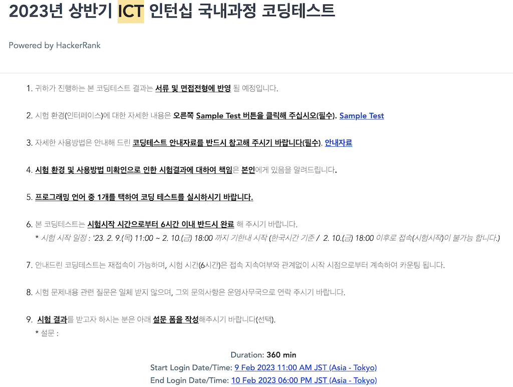
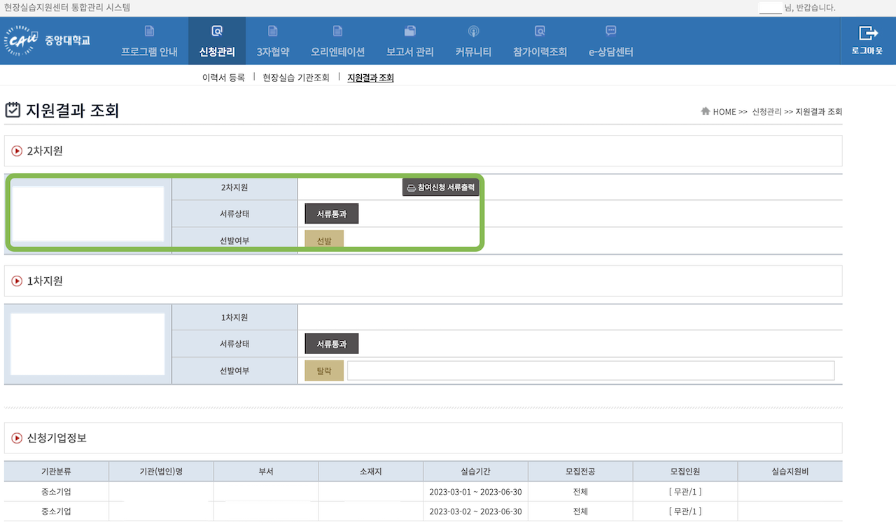
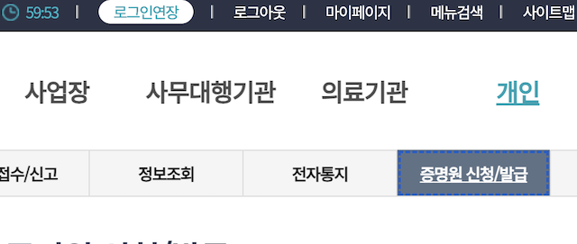
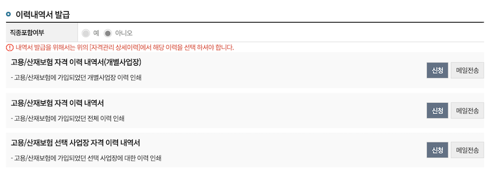

# ICT인턴십 경험담

저는 이번 학기에 `2023년 상반기 ICT학점연계프로젝트인턴십(국내과정)`을 하게 되었습니다.

아무래도 문서화된 상세한 정보가 없어서 이것저것 궁금한 것을 친구들에게 물어보고는 했습니다.
제가 ICT인텁십 지원부터 보고서 작성, 학점 인정까지 모든 과정을 공유하면 도움이 되지 않을까해서 적어봅니닷..

❗️ 기업명, 업무 내용, 제 개인정보, 등의 정보는 모두 가리고 올립니다.

:::danger 주의 - 참고용으로만!
제가 경험한 내용을 적습니다.

이 모든 내용은 개인적으로 알아보거나 겪은 내용이기 때문에 정확한 정보가 아닐 수 있습니다.
관련 내용은 참고용으로만 쓰시고 꼭 한번 관련 기관에 문의해보시길 바랍니다.
:::

## ICT학점연계프로젝트인턴십 기간

`23년 상반기 4개월 (3월 2일 ~ 6월 30일)

- 일 8시간
- 주 5회

## 지원

학교에서 올려준 공지글을 보고 ICT학점연계프로젝트인턴십(줄여서, ICT인턴십)에 대해서 알게되었습니다.

> 공지글 [(링크)](https://swedu.cau.ac.kr/board/view?menuid=001005005&pagesize=10&boardtypeid=7&boardid=680)

### 지원 자격

- 신청일 기준 교육과정 50% 이상 이수자여야 합니다.
  - 4년제 대학 기준 `4학기 이상 이수자`여야 합니다.
- 승인된 대학 내 참여학과 `전공/복수전공/부전공` 학생이어야 합니다
  - 승인 대학 및 참여학과 여부는 홈페이지 공지사항에 올라옵니다.
- `3월 1일 ~ 6월 30일` 인턴십 전체 기간동안 인턴십을 정상적으로 수행하고 그에 대한 학점 이수가 가능한 **재학생**이어야 합니다.
  - 우리는 등록금을 전부 납부하셔야 합니다.
- 졸업유예자, 초과학기생 등 특수한 상황인 경우 반드시 학교 측에 사전 문의를 통해 참여 가능 여부 확인해야 합니다.
  - 우리 학부는 졸업유예자의 경우 풀-등록금을 납부해야 학점 인정 가능하답니다.

### 지원 과정

1. 서류 접수

- 지원서와 함께 원하는 기업에 신청합니다.

2. (요구 시) 코딩 테스트

- 코딩 테스트를 요구하는 기업에 한해서 코딩 테스트를 봅니다.

3. 면접

- 서류전형을 합격했다면, 면접을 봅니다.

4. 확정

- 합격한 기업 중, 한 곳을 확정지어야 합니다.

5. 학교와 연계 (placement, 3자 협약)

- `1.`~`3.`까지의 지원과정은 ICT인턴 기관을 통해 수행됩니다. 사무국에서 합격자 명단을 학교에 넘겨주면 기업과 우리 학교와 협약을 해야 합니다.
- 이메일을 통해 안내가 계속 오기 때문에 어려운 것은 없었습니다.

---

> 각각의 지원과정에 대해서 상세히 알아봅시다.

#### 1. 서류 지원하는 법

관련해서는 매뉴얼에 잘 안내되어 있습니다.  
매뉴얼: [(링크)](https://ictintern.or.kr/jsp/common/login_board_detail.do)

따로 연락주시면 제 이력서, 자소서, 포트폴리오도 공유해드릴 수 있습니다. 여기에 올리기에는 부끄럽네요..

1. 공식 홈페이지(<https://ictintern.or.kr/>) 접속 및 로그인
   - 계정 없으면 회원가입
2. 인턴십참여 탭의 `인턴십신청` 클릭
   
3. 인턴십 지원 희망기업 `지원` 클릭

:::tip 최대 3개
최대 3개 기업에 지원 가능하며 여러 곳을 합격하셨다면 나중에 한 곳만 확정지으시면 됩니다.  
신청 기간 동안 지원했던 기업의 지원을 취소하고 다른 곳에 신청할 수도 있습니다.  
:::

#### 2. 코딩 테스트

코딩 테스트(줄여서, 코테)를 보는 기업이 있고 안 보는 기업이 있습니다.

코테를 요구하는 기업의 명단은 [공식 사이트](https://ictintern.or.kr/homepage/notice/noticeList.do)에 공지됩니다.  
그리고 신청할 때 인턴 공고에도 보시면 코테 보는지 안 보는지 적혀있습니다.

#### 코테 형식

여러 기업이 모두 코딩 테스트를 요구하더라도 코테는 딱 한번만 치면 됩니다.

코테는 [Hacker Rank](https://www.hackerrank.com/)라는 해외 사이트에서 쳤으며 이 점수가 지원한 기업에게 전달됩니다.

해외사이트이기 때문에 문제는 영어입니다.  
이틀 내에 편한 시간대에 시작하며 됐었고 시간은 6시간이 주어졌기 때문에 여유롭습니다.

#### 난이도

난이도는 백준 기준 "실버 ~ 골드 하위권" 정도로 느껴졌습니다.

완전탐색, DFS, DP(골드급 문제) 문제가 나왔습니다.

#### 3. 면접

면접 방식은 기업마다 다릅니다. 저는 1시간 정도 오프라인 면접을 봤습니다.

##### 합격한 경우

합격하면 문자 or 이메일 or 전화가 옵니다.  
ICT인턴 사무국 측에서도 기업에게 일정에 맞추어 결과를 보내주길 요구하는 것 같더라고요!

##### 불합격한 경우

하지만 불합격한 경우 아무런 연락이 안 올수도 있습니다.  
저는 불합격한 곳에서는 연락이 안 왔습니다.

> 한 곳은 서류 합격이라고 전화와 이메일을 주고 면접 희망 일정까지 받고 전형 기간 끝까지 면접에 관한 안내가 안 오는 것을 무작정 기다리고 있었습니다.  
> 알고보니 마음이 바뀌었는지 그냥 서류 불합격 처리해놓고 나중에 면접 일정 거의 끝날 때 이메일이 와있었습니다. 불합격했다고...

이렇게 안내가 늦는 경우 탈락일 확률이 높습니다.  
계속 기다리고 있기보다 ICT인턴십 공식 사이트에서 `매칭현황`을 보면 바로 아실 수 있습니다.

1. 인턴십참여 탭 '매칭현황' 클릭
   

2. 서류 전형 결과 확인
   

#### 4. 확정

면접까지 모두 합격한 경우 ICT인턴십 사이트에서 한 곳을 확정해야 합니다.

- 한 곳만 합격했어도 확정해주셔야 합니다.

관련해서 자세한 안내 메일이옵니다.

#### 5. 학교와 연계 (placement, 3자 협약)

##### 행정 처리

관련하여 어떤 것을 해야 할지 다빈치SW교육원으로부터 별도로 연락이 게속 옵니다.  
한글 파일 몇 개를 작성했습니다.

- 개인정보 제공 동의서
- 자격요건 확인서
- 기타 해야 할 것 안내

관련해서 안내 이메일을 수신하지 못했다면 다빈치SW교육원에 연락해보세요.

##### 학교와의 연계

다빈치SW교육원으로부터 받은 이메일 스샷입니다.

요약하자면 다음과 같습니다.

- 합격한다면 수강 신청한 모든 과목을 드랍(삭제)해야 합니다.
  - 합격 발표가 늦으면 정정 때라도 해야 합니다.
  - 그래야 인턴십 과목을 넣어줄 수 있다고 합니다.
- 인턴십 완료시점에 보고서 작성, 수료증 업로드 등이 완료되면 최종적으로 학점인정이 됩니다. (전공 15학점)
  - 소프트웨어학부의 경우 공학주제, 캡스톤 대체 등을 인정받으려면 별도의 서류를 작성해야 합니다.
- 합격하신 기업에서 중앙대로 신청서를 작성해줘야 [중앙대 현장실습지원센터 통합관리 시스템 사이트](https://placement.cau.ac.kr/)(줄여서, placement 사이트)에 기업명이 뜹니다.

##### 3자 협약

> 이것도 메일로 자세히 안내 되어있습니다.

위에 언급했듯이 기업에서 신청서를 작성하고 처리가 되면 [placement 사이트](https://placement.cau.ac.kr/)에 뜹니다. 그걸 검색해서 신청하시면 됩니다.

1. 중앙대 [placement 사이트](https://placement.cau.ac.kr/)에 접속합니다.
2. 이력서, 자소서, 서약서 동의서를 등록 합니다.
   안내 메일에 첨부된 가이드북 따라하면 됩니다.
   
3. 확정한 기업을 검색해서 신청합니다.

   - 위에서 언급했듯이, placement 사이트에 합격하신 기업이 없다면 신청서를 작성하지 않아서 그런 걸 수도 있습니다.
     
   - 기다리니 기업에서 다 통과시켜줬습니다.
     

4. 3자 협약
   - 3자 협약 탭에 들어가서 실습기관, 학생, 대학 간의 협약을 진행합니다.
     
   - 표준현장실습학기제(Co-op) 협약서 작성  
     저는 첫 출근일에 대표님께서 부르셔서 같이 사인했습니다.

---

### 실습 중

#### 오픈톡방 초대

  
인턴십에 합격하게 되면 LINC 사업운영팀으로부터 공지를 전달받을 수 있는 오픈톡방에 초대하는 메일이 옵니다.

해당 톡방에서 인턴십을 하면서 해야 할 것을 자세하게 전달 받을 수 있습니다.

#### 산재보험 제출

:::tip 4대보험 관련
4대보험은 필수가 아닙니다. 산재보험은 필수입니다.

4대보험은 필수가 아니기 때문에 별도로 기업과 얘기가 되어야 가입할 수 있습니다.
:::

실습 시작 후에 산재보험 가입되면 산재보험증명원 발급 후 placement 사이트에 제출합니다.

입사 후에 산재보험 가입되면 제출합니다.

산재보험증명원은 [고용-산재보험 토탈 서비스](https://total.comwel.or.kr/)에서 편하게 발급 받을 수 있습니다.

먼저 로그인을 합니다. 간편인증이 되어서 편합니다.

상단의 `증명원 신청/발급` 메뉴를 클릭합니다.

`고용-산재보험 자격 이력 내역서` 사이드바 메뉴를 클릭합니다.

보험구분은 신재, 죄회구분은 상용으로 체크하고 `조회` 버튼을 클릭합니다.

그러면 최근 자격 현황에 제 기업이 떠야 합니다.

뜨셨다면 원하는 이력을 체크하시고 아래로 스크롤하셔서 원하는 이력내역서를 신청하면 됩니다.
바로 PDF로 출력할 수 있습니다!

"고용산재보험 자격 이력 내역서"를 발급 받아 보면 대충 이런식으로 나옵니다!

#### 보고서 작성

##### 주간 보고서

TBD

> 아직 안 해봤습니다.

##### 종합 보고서

TBD

---

### 실습 후

#### 수료증 제출

TBD

#### 공학인증과 캡스톤 인정 받기

> 서류 2개 과사에 제출?
> TBD

---

### 개인적으로 알아본 정보

- ICT인턴과 관련해서는 산업체협력단(placement)에서는 잘 모릅니다.
  - 다빈치SW교육원으로 연락해야 합니다.
  - 그 외의 placement와 관련해서는 이곳에 연락하는 것이 맞습니다.
- 다빈치SW교육원은 ICT인턴쪽으로부터 합격자 명단을 전달 받은 후 LINK사업단에 전달하는 등 행정적인 처리를 시작합니다.
  - 그래서 산업체협력단(placement 사이트)에 등록은 위와 같은 행정적인 처리가 끝나야 됩니다.
  - 이 과정에서 placement에 기업이 등록되고 나에게 15학점이 입력되고 이것으로 15학점을 인정받을 수 있게 됩니다.
- 학점을 인정받으려면 현장실습(placement 사이트)에 2월 28일 전까지 기업이 등록하고 학생이 신청해서 연결되어 있어야 합니다.
- 인턴십이 끝난 이후에 소프트웨어학부의 캡스톤 과목 대체를 인정 받으려면 두 가지의 서류를 추가로 제출해야 한다고 합니다.

---

## 추가

> 인턴십 관련 다른 정보 글

- [외부인턴 지원부터 협약까지](https://everytime.kr/398053/v/285275849)
- [2022 상반기 ICT 학점연계 인턴십 참가 후기](https://everytime.kr/398053/v/258134997)
